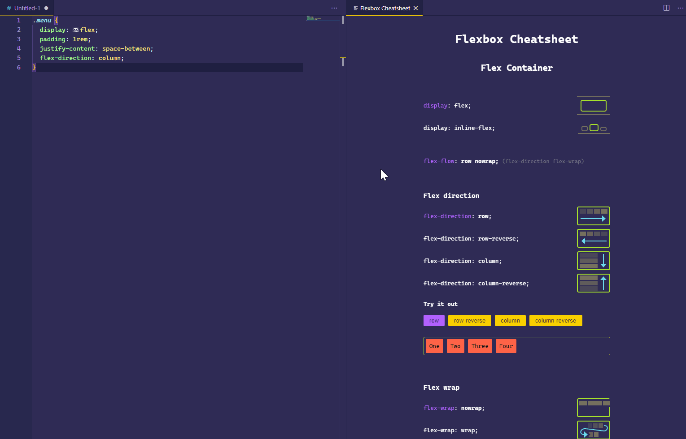

# Alurinha-Flexbox

<h2 align="center"> Modulo do programa One: Flexbox: posicione elementos na tela</h2>
 

 

## :bookmark_tabs: Ferramentas e Tecnologias utilizadas no Projeto:

<li>- Especificações flexible box para posicionar seus elementos na página;</li>
<li>- Propriedades do flexbox e como usá-las;</li>
<li>- Como as propriedades do flexbox substituem float, inline e inline-block;</li>
<li>- Site responsivo com flexbox. </li>
 

<h2 align="center"> 
    :construction_worker:  Projeto sempre em desenvolvimento  :construction:
</h2>
 

## 📁 Acesso a pagina

:link: <a href="https://amandaafernandes.github.io/Alurinha-Flexbox/" target="_blank" rel="noopener noreferrer"> Link da pagina Alurinha </a>  
(pagina estática). 

## :computer: 
<li>HTML5;</li>
<li>CSS 3;</li>
<li>Git e Guithub.</li>
(trilha front end - Programa One de Alura + Oracle).
